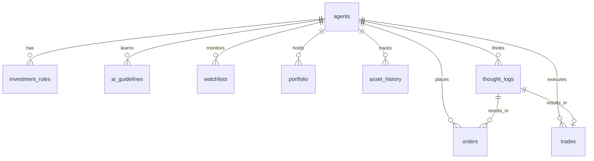

# データベース仕様 (Data Schema)

本ドキュメントは、`docs/specs/spec.md` の要件を満たすためのデータベース（SQLite3）のテーブル定義およびスキーマ仕様をまとめたものです。
旧システム（`_regacy/trader/backend/models.py`）の構造をベースとしつつ、AIの自律的なウォッチリスト管理や待機注文（Pending Order）などの新機能に対応する形にアップデートしています。

## ER図 (Entity Relationship)

## テーブル定義

### 1. エージェント管理 (`agents`)
複数の投資ルール（戦略）を独立して稼働させるためのエージェント設定を管理します。
* **id** (Integer, PK): エージェントID
* **name** (String): エージェント名（例: "高配当バリュー株投資家"）
* **initial_cash** (Float): シミュレーション開始時の初期資金
* **current_cash** (Float): 現在の利用可能な現金残高
* **ai_model** (String): 使用するAIモデル（例: `gemini-1.5-pro`）
* **auto_schedule_enabled** (Boolean): 自動実行が有効かどうか
* **schedule_time** (String): 自動実行を行う時刻（例: `16:00`）
* **auto_execute_trades** (Boolean): AIの判断をそのまま自動発注するかどうかのフラグ
* **created_at** (DateTime): 作成日時

### 2. アクティブ・ウォッチリスト (`watchlists`)
現在進行形で監視対象となっている銘柄の「状態（State）」を管理するテーブルです。人間またはAIが追加したものがここに入ります。
※重複登録を防ぐため、`(agent_id, ticker)` の組み合わせでユニーク制約（Unique Constraint）をかけます。
* **id** (Integer, PK)
* **agent_id** (Integer, FK): 対象エージェントID
* **ticker** (String): 銘柄コード（例: `7203`）
* **tags** (String): 現在適用されているタグのJSON配列（例: `["自動車", "円安メリット"]`）
* **added_by** (String): `USER` または `AI`
* **created_at** (DateTime): 初回追加日時
* **updated_at** (DateTime): 最終更新日時

### 3. AI銘柄発掘・判断履歴 (`ai_discovery_logs`)
AIが「なぜその銘柄に注目したか（または監視から外したか）」という「履歴（History）」をすべて蓄積するログテーブルです。
ウォッチリスト（監視状態）とは別に切り離すことで、「過去1ヶ月でAIが何度トヨタ自動車を推薦したか（頻度）」や「その時々の着眼点の変遷」をデータとして分析・表示できるようになります。
* **id** (Integer, PK)
* **agent_id** (Integer, FK)
* **ticker** (String): 対象銘柄
* **action** (String): `ADD` (監視追加推奨), `REMOVE` (監視除外推奨), `UPDATE` (タグや評価の更新)
* **reason** (String): なぜそのアクションをとったかの理由文
* **tags** (String): その時点でAIが提案したタグ
* **created_at** (DateTime): 記録日時

### 4. 投資ルール (`investment_rules`)
ユーザーが自然言語で指定したエージェントの基本戦略・ルールを保存します。
* **id** (Integer, PK)
* **agent_id** (Integer, FK)
* **rule_text** (String): ルール本文（プロンプトに組み込まれる）
* **version** (Integer): ルールのバージョン（履歴管理用）
* **created_at** (DateTime)

### 5. 教訓・ガイドライン (`ai_guidelines`)
過去のトレード結果からAI自身が反省し、学んだ教訓を保存します。
* **id** (Integer, PK)
* **agent_id** (Integer, FK)
* **guideline_text** (String): 教訓本文（プロンプトに組み込まれる）
* **version** (Integer): バージョン
* **created_at** (DateTime)

### 6. 思考・推論ログ (`thought_logs`)
AIがなぜその行動（売・買・待）をとったのかの推論プロセスを記録します。将来の反省や、MCP経由での過去のトレード履歴の振り返り（`get_past_trade_history`）で活用されます。
* **id** (Integer, PK)
* **agent_id** (Integer, FK)
* **ticker** (String): 対象銘柄
* **action** (String): `BUY`, `SELL`, `HOLD`
* **price** (Float, Nullable): 想定価格・指値
* **quantity** (Integer, Nullable): 想定数量
* **reasoning_text** (String): 推論プロセスの詳細（なぜその判断をしたのか）
* **reflection_text** (String, Nullable): 取引結果に対する事後の反省内容
* **created_at** (DateTime)

### 7. 注文データ (`orders`)
待機注文（Pending Order）システムを実現するためのテーブルです。AIが注文を出した後、市場が開いたタイミング等で約定判定が行われます。
* **id** (Integer, PK)
* **agent_id** (Integer, FK)
* **ticker** (String): 対象銘柄
* **action** (String): `BUY`, `SELL`
* **order_type** (String): `MARKET` (成行), `LIMIT` (指値)
* **price** (Float, Nullable): 指値の場合の指定価格
* **quantity** (Integer): 注文数量
* **status** (String): `PENDING` (待機中), `FILLED` (約定済), `CANCELLED` (取消), `EXPIRED` (期限切れ)
* **thought_log_id** (Integer, FK): どの推論に基づいて出された注文か
* **created_at** (DateTime)

### 8. 約定履歴 (`trades`)
実際に約定した取引の履歴です。
* **id** (Integer, PK)
* **agent_id** (Integer, FK)
* **ticker** (String): 対象銘柄
* **action** (String): `BUY`, `SELL`
* **price** (Float): 約定価格
* **quantity** (Integer): 約定数量
* **thought_log_id** (Integer, FK): ベースとなった推論ログのID
* **created_at** (DateTime)

### 9. ポートフォリオ (`portfolio`)
エージェントが現在保有している資産（建玉）の状況を管理します。
* **id** (Integer, PK)
* **agent_id** (Integer, FK)
* **ticker** (String): 保有銘柄
* **quantity** (Integer): 保有数量
* **average_cost** (Float): 平均取得単価
* **updated_at** (DateTime): 最終更新日時

### 10. 資産推移履歴 (`asset_history`)
シミュレーションにおける日々の資産状況の変化を記録し、チャート描画などに使用します。
* **id** (Integer, PK)
* **agent_id** (Integer, FK)
* **date** (Date): 記録日
* **cash_balance** (Float): 当日の現金残高
* **total_stock_value** (Float): 当日の株式評価額の合計
* **total_assets** (Float): 当日の総資産（現金＋株式評価額）

### 11. システム設定 (`system_settings`)
エージェントに依存しない、システム全体の共通設定を管理するKVS（Key-Value Store）です。
* **key** (String, PK): 設定キー
* **value** (String): 設定値
* **updated_at** (DateTime)

### 12. MCPサーバー管理 (`mcp_servers`)
Web画面からMCPサーバーの接続情報（コマンド、引数、環境変数など）を直接追加・編集できるようにするためのテーブルです。`mcp_servers.json` の内容をデータベース上で一元管理します。
* **id** (Integer, PK)
* **name** (String): サーバーの一意な名前（例: `brave-search`）
* **command** (String): 実行コマンド（例: `npx`, `python`）
* **args** (String): コマンド引数のJSON配列（例: `["-y", "@modelcontextprotocol/server-brave-search"]`）
* **env** (String): 必要な環境変数のJSONオブジェクト（例: `{"BRAVE_API_KEY": "..."}`）
* **is_global_enabled** (Boolean): システム全体でこのサーバーを有効にするかどうかのフラグ
* **created_at** (DateTime)
* **updated_at** (DateTime)

### 13. エージェント別MCPツール権限 (`agent_mcp_configs`) - ※オプション
「エージェントAはWeb検索(Brave)を使えるが、エージェントBは使えない」といったエージェントごとのツール権限を管理するテーブルです。
* **id** (Integer, PK)
* **agent_id** (Integer, FK)
* **mcp_server_id** (Integer, FK): `mcp_servers` テーブルのID
* **is_enabled** (Boolean): 有効/無効フラグ
* **created_at** (DateTime)

### 14. シグナル検知プラグイン管理 (`signal_plugins`)
事前の足切り判定（イベント検知）を行うPythonプラグイン（`plugins/signals/` 配下等）を管理します。
* **id** (Integer, PK)
* **name** (String): プラグインの識別名（例: `price_surge`, `news_alert`）
* **description** (String): 概要（例: "前日比±3%の変動を検知"）
* **file_path** (String): 実行するPythonファイルのパス（例: `plugins/signals/price_surge.py`）
* **is_global_enabled** (Boolean): システム全体で有効にするか
* **created_at** (DateTime)
* **updated_at** (DateTime)

### 15. エージェント別プラグイン設定 (`agent_plugin_configs`)
「どのアラート検知プラグインを、どのエージェントに適用するか」を管理します。エージェントの性格に合わせたカスタマイズに利用します。
* **id** (Integer, PK)
* **agent_id** (Integer, FK)
* **plugin_id** (Integer, FK): `signal_plugins` テーブルのID
* **is_enabled** (Boolean): 有効/無効フラグ
* **parameters** (String): プラグインに渡すパラメータのJSON（例: `{"threshold_percent": 5}`）
* **created_at** (DateTime)

## 旧システムからの主な変更点・対応ポイント
1. **`watchlists`の独立テーブル化**:
   旧システムでは `agents` テーブルの `watchlist` カラムにJSON文字列として格納していましたが、AIによる動的な追加・削除や、「タグ付けによる静的オントロジー」に対応するため独立したテーブルに変更しました。
2. **`orders` テーブルによる待機注文の実現**:
   即時約定ではなく、AIが発注した注文を一旦 `orders` に `PENDING` 状態で保存し、実際の市場データ（翌日の始値や高値・安値）と突き合わせて `FILLED` にするフローをサポートします。
3. **`thought_logs` の `reflection_text`**:
   取引後の結果を振り返って反省を記録するためのカラムを用意しており、この内容が将来的に `ai_guidelines`（教訓）のアップデートに寄与します。
