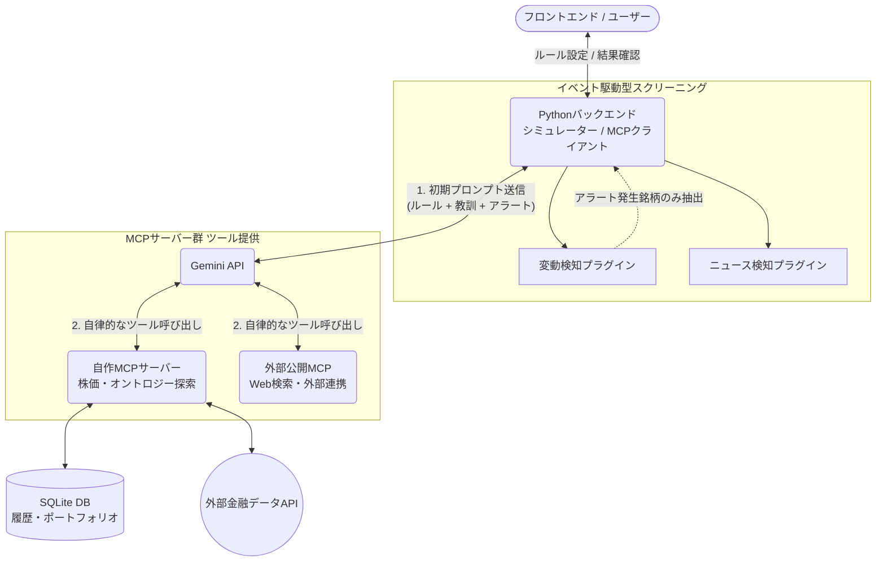
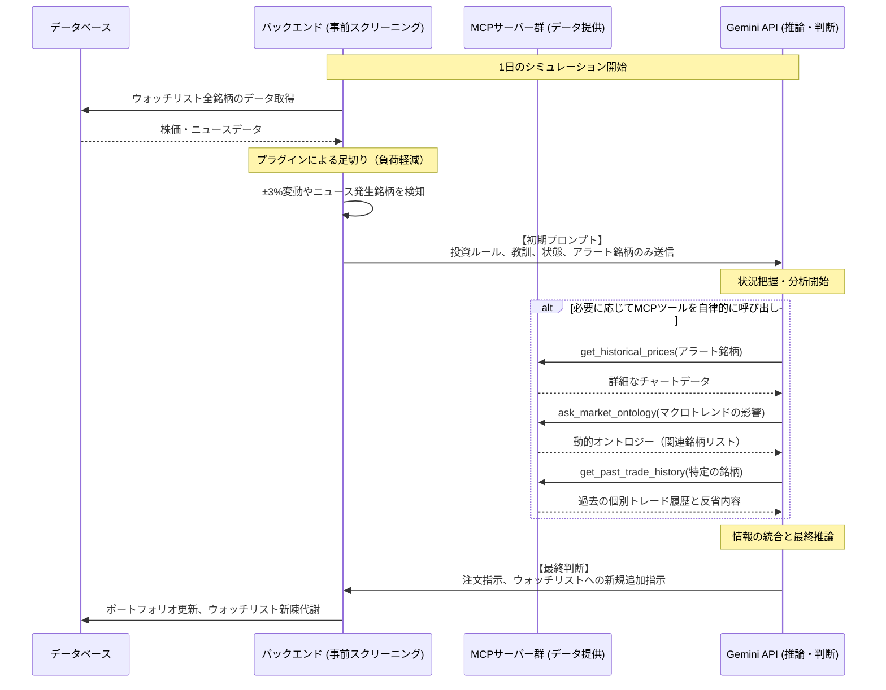

# 投資エージェントシミュレーター 要件定義

## 1. システム概要

本システムは、ユーザーが自然言語の文章で指定した「投資ルール（トレードスタイル）」と、過去の取引結果から自ら学んだ「教訓」を組み合わせて、AIエージェント（Gemini API）が自律的に日本株の売買判断を行う投資シミュレーターです。
**複数の投資ルール（プロンプト）を「別々のエージェント（戦略）」として同時に稼働**させることができ、エージェントごとに独立したポートフォリオ、資産推移、教訓を管理・比較できる点が最大の特徴です。

## 2. システム構成

### 2.1 技術スタック

*   **フロントエンド**: Nuxt 3 (Vue 3)
*   **バックエンド**: Python 3 (FastAPI)
*   **AIモデル**: Gemini API
*   **データベース**: SQLite3

### 2.2 システムアーキテクチャ図（全体像）

システム全体の連携（プラグイン、MCPサーバー、AI）を図解します。

### 2.3 シミュレーション実行シーケンス図（1日の流れ）

イベント駆動のスクリーニングから、AIがMCPを使って自律的に深掘りし、注文を出すまでの流れを図解します。

## 3. MCP（Model Context Protocol）連携とアーキテクチャ設計

本システムでは、シミュレーター本体（バックエンド）を**「MCPクライアント」**として実装します。これにより、AIが自律的に必要な市場情報を取得し分析できるだけでなく、外部ツールとの疎結合な拡張が可能になります。

### 3.1 MCPベースの拡張アーキテクチャ
システムは以下の2種類のMCPサーバーと連携して動作します。

1. **プロジェクト内蔵の独自MCP（ローカルプラグイン開発）**
   *   株価取得、ニュース検索、オントロジー探索などのコア機能は、プロジェクトリポジトリ内の独立したモジュール（例: `mcp_server/` ディレクトリ）として開発します。
   *   これにより、プラグインのように手軽にプロジェクト内で開発・追加しつつ、標準規格（STDIO等）で通信するクリーンな独立性を保ちます。この自作MCPは、Claude Desktop等の外部エディタから直接呼び出してテスト・利用することも可能です。
2. **外部の公開MCPサーバー（サードパーティ）**
   *   Brave Search（Web検索）、GitHub連携、Slack通知など、世界中で公開されている外部のMCPサーバーを、設定ファイルに追加するだけで即座にAIのツールとして拡張利用できます。

### 3.2 データ連携フロー

1. **初期プロンプトの送信 (バックエンド → AI)**: バックエンドは「エージェントの性格（投資ルール）」「過去の教訓」「現在の保有資産・ウォッチリスト」「利用可能なMCPツールの一覧」のみをAI（Gemini API）に送信します。
2. **AIによる自律的なデータ収集 (AI ↔ MCPサーバー)**: AIは必要に応じてMCPサーバーのツール（株価取得、ニュース検索、PDF分析など）を呼び出し、動的に情報を収集します。
3. **推論と最終判断 (AI → バックエンド)**: 収集した情報を分析し、最終的な売買判断（注文内容）を所定のJSONフォーマット等でバックエンドへ返却します。
4. **シミュレーション実行 (バックエンド → データベース)**: システムがAIの注文を受け取り、ポートフォリオや注文履歴を更新します。

### 3.2 想定されるMCPツール

AIが呼び出せるように定義するツールの例：
*   `get_historical_prices(ticker, days)`: 指定銘柄の過去N日間の四本値・出来高を取得する。
*   `search_financial_news(ticker)`: 指定銘柄に関する最新の経済ニュースや適時開示情報を取得する。
*   `analyze_company_pdf(url_or_path, query)`: 決算短信などのPDFドキュメントを分析し、指定した質問に対する回答を抽出する。
*   `get_market_sentiment()`: 日経平均やTOPIXなどの全体的な市場トレンド指標を取得する。

### 3.3 プロンプト設計と情報提供の棲み分け

AIのコンテキスト制限とノイズを最小化するため、「常に意識させるべき必須コンテキスト」は初期プロンプトに直接埋め込み、「詳細な履歴や外部データ」はMCPツール経由で取得させるハイブリッドな設計とします。

**1. 初期プロンプトに直接埋め込む情報（常に意識させるコンテキスト）**
*   **ロール設定と投資ルール**: 熟練トレーダーとしての役割と、ユーザーが定義した手法の厳守。
*   **一般化された教訓（普遍的なルール）**: 多数の取引経験から抽出・抽象化されたルール（例：「決算直前の持ち越しは避ける」等）。どんな銘柄を取引する際にも「エージェントの性格・方針」として厳密に守らせるためプロンプトに明記します。
*   **現在のポジション（保有状況）**: 保有銘柄、株数、平均取得単価、現在の評価損益、現金残高。利確・損切りや資金管理の前提となります。
*   **現在の注文状況**: 現在未約定（Pending）となっている待機注文の一覧。
*   **状態の提供**: ウォッチリスト対象銘柄、シミュレーション上の現在日時。
*   **指示内容**: 提供されたMCPツールを自律的に使用して市場を分析し、推論プロセスを提示した上で、最終的な注文内容を出力すること。

**2. MCPツール経由で提供する情報（必要に応じて深掘りさせるデータ）**
*   **個別のトレード履歴と反省**: 指定した銘柄に対する「過去の取引結果（売買日時・価格）」と「当時の判断理由・個別の反省内容」。プロンプトの圧迫を防ぐため、AIが特定の銘柄に対する過去の成功・失敗を振り返りたい時のみ `get_past_trade_history(ticker)` などのツールで個別に引き出させます。
*   **市場データ・ニュース**: 株価の推移や最新のニュース、外部ドキュメント分析など（セクション3.2参照）。

### 3.4 オントロジー（市場構造）の動的探索

「A社のニュースがB社にどう影響するか」といった市場の構造的な連鎖（オントロジー）をAIに理解させる仕組みを導入します。巨大な関係性データベースを事前に構築するコストを回避するため、以下の「仮想オントロジー」と「スモールスタート」のハイブリッド方式を採用します。

1. **タグ付けによる静的オントロジー（スモールスタート）**
   *   ウォッチリストの銘柄データに、属性（タグ）を付与できる仕組みを導入します。
   *   例：`["自動車", "円安メリット", "高配当"]`
   *   AIはこれらの属性をセクターやテーマのグループとして捉え、「円安トレンドなので『円安メリット』タグの銘柄群を一括でスキャンする」といった面的な分析が可能になります。

2. **LLMの内部知識を活用した「動的オントロジー生成」（仮想オントロジー）**
   *   企業間のサプライチェーンや競合関係の情報を自前で管理する代わりに、MCPツールとして `ask_market_ontology(query)` を定義します。
   *   AIが「トヨタ自動車（7203）の主要な国内サプライヤーは？」とツールに問い合わせた際、MCPサーバーが裏側で別のLLM APIや検索システムを利用し、関連する企業群を推論して動的にリストを返します。
   *   これにより、事前のデータ構築作業をほぼゼロに抑えつつ、AIが自律的に市場の繋がり（サプライチェーンやマクロ・ミクロの波及効果）を探索し、構造的なトレード判断を下すことが可能になります。

### 3.5 トップダウン型スクリーニングとウォッチリストの動的拡張

あらかじめ決められた銘柄（ボトムアップ）だけでなく、マクロ環境（市場トレンド）からAIが自律的に有望なセクターや銘柄を絞り込む「トップダウン方式」を実現するため、以下の機能と権限を付与します。

1. **スクリーニング用MCPツールの提供**
   *   `search_stocks_by_theme(theme, criteria)` のようなツールを定義します。
   *   AIが市場全体のセンチメントを把握した後、「現在は円安・金利高トレンドである」と判断した場合、自律的に「メガバンク」や「輸出関連」といったテーマをこのツールで検索し、分析対象の銘柄群を抽出します。

2. **ウォッチリストの動的更新（AIによる銘柄発掘）**
   *   AIに `add_to_watchlist(ticker, reason)` および `remove_from_watchlist(ticker)` のアクション（MCPツールまたは出力フォーマットの一部）権限を与えます。
   *   スクリーニングやオントロジー探索によって有望な銘柄を新たに見つけた場合、AIは自らの判断でそれを自身のウォッチリスト（監視対象）に追加します。
   *   これにより、人間が手動で銘柄をメンテナンスしなくても、AIがマクロ環境や旬なテーマに合わせて投資先（監視先）を自動的に新陳代謝させていく完全自律型の運用が可能になります。

### 3.6 イベント駆動型のアラート検知（プラグインアーキテクチャ）

ウォッチリストの登録銘柄数が増加した場合、全銘柄の情報を毎日AIに分析させると、APIの通信負荷・コストの増大や、AIの注意散漫（Attention Dilution）による判断精度の低下を招きます。これを防ぐため、**「処理の重いAIには、本当に確認が必要な銘柄だけを絞り込んで渡す」イベント駆動型のアプローチ**を採用します。

1. **バックエンドでの事前スクリーニング（シグナル検知）**
   *   ウォッチリスト全銘柄の「足切り判定」はAIではなく、高速で安価なPythonバックエンドが担当します。
   *   株価の急変動、テクニカル指標のブレイク、ニュースの発生など、何らかの「イベント（シグナル）」が発生した銘柄だけを抽出し、AIへの初期プロンプト（アラート文）として渡します。AIはそのアラートを見て、該当銘柄のみをMCPツールで深掘りします。

2. **検知ロジックのプラグイン化**
   *   シグナルを検知する計算ロジックは、コアシステム（`engine.py`等）にベタ書きするのではなく、独立したファイルとして `plugins/signals/` ディレクトリ等に配置する「プラグインアーキテクチャ」を採用します。
   *   **メリット**:
       *   **高い拡張性と保守性**: 新しいテクニカル指標や検知ルールを追加する際、コアコードを汚さず、新たなPythonファイルをフォルダに追加するだけで済みます。
       *   **エージェントごとのカスタマイズ**: エージェントの性格に合わせて「どの検知プラグインを有効にするか」をDB等で柔軟に切り替えられます。
       *   **AI自己拡張への布石**: 将来的には、「AI自身が自らの反省から新しい検知ロジック（Pythonコード）を生成し、プラグインとして追加する」という完全自己進化型の基盤となります。

